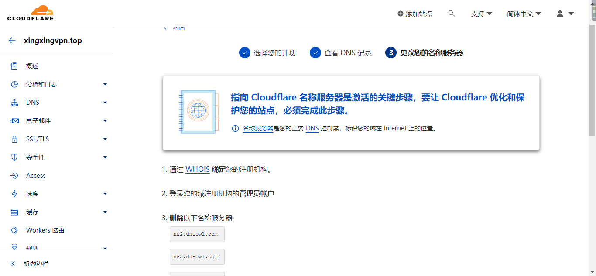
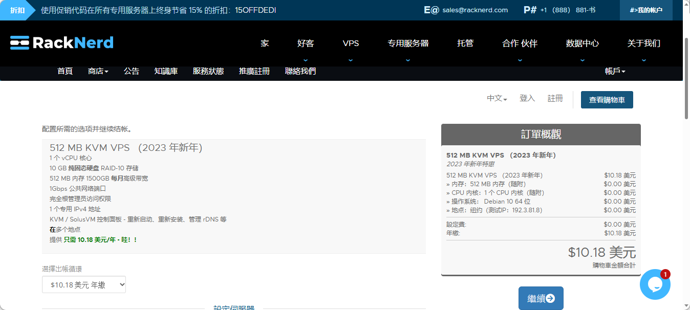
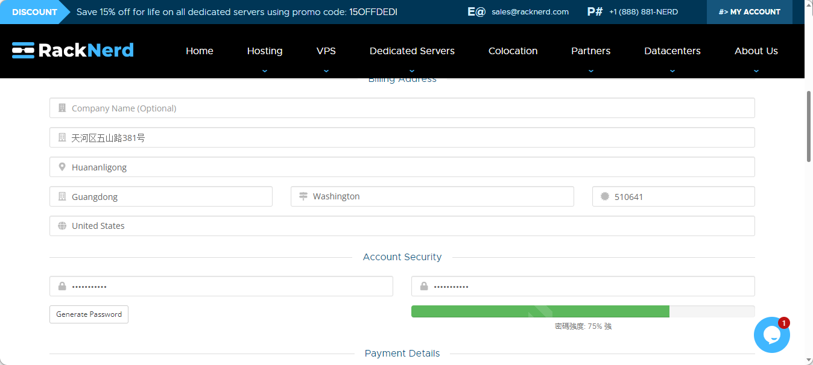
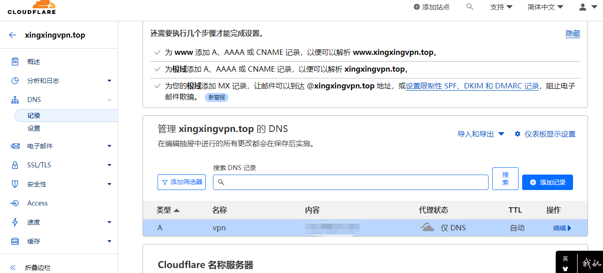
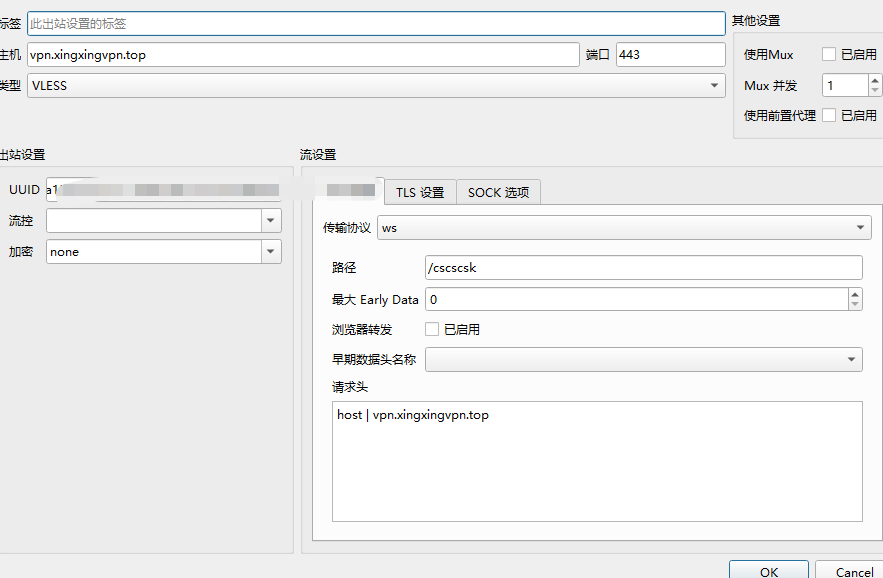

参考文章：https://v2rayssr.com/teach-vless.html

## 买域名

参考域名网站：https://www.namesilo.com/cart

1. 注册账户

   

2. 购买，便宜域名只需要1.88刀

3. 

## 购买 VPS

[VPS GO - 便宜VPS，VPS推荐，美国主机，香港服务器，VPS教程](https://www.vpsgo.com/)

我选了这个

[RackNerd LLC](https://my.racknerd.com/cart.php?a=confproduct&i=0&language=chinese)



购买成功配置SSH(**我买的这个会发邮件告诉你ip和密码**)




绑定DNS并且ping 域名




打开控制台

```
ping 你的域名
```

ping成功之后我们接着配置vps服务器

```
apt update -y          # Debian/Ubuntu 命令
apt install -y curl socat    #Debian/Ubuntu 命令
bash <(curl -Ls https://raw.githubusercontent.com/vaxilu/x-ui/master/install.sh) #X-ui面板安装
```


*感觉有点慢*

配置Qv2Ray



大概如上图这样，填写自己的域名，**请求头**填自己的域名。

教程里的所谓拯救垃圾VPS看来无用！！



如果 显示缺少核心文件


要下载4.4.5的V2raycore,然后解压到Qv2Ray同文件夹下



建议还是弄其他的代理

比如Clash



PS: 不知道是我买的服务器问题还是什么，花了半天时间都没调好速度，最快也才1M多速率。

